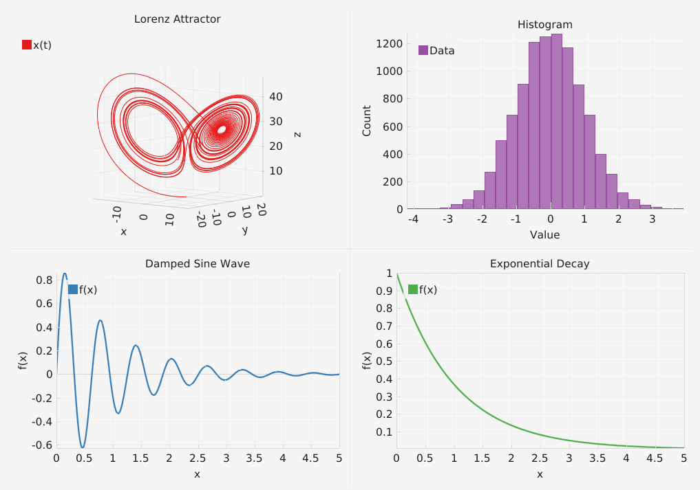

# theoretica-gui
A graphical interface for the Theoretica library, in its experimental stage.

## Setup
The project is easy to setup using CMake:

```bash
mkdir build
cd build
cmake ..
cmake --build .
```

The module depends on ImGui, ImPlot, ImPlot3D and Theoretica (core).

# Example Program
The example program runs a few algorithms in Theoretica and displays the results.


